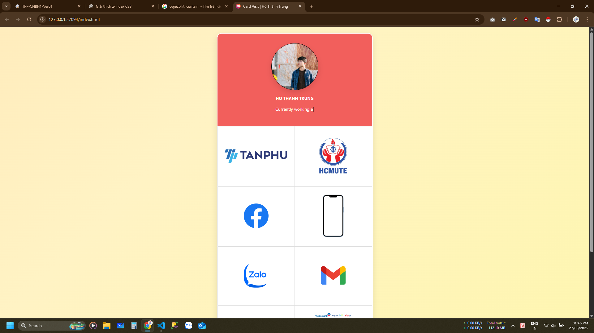

# Card Visit | Hồ Thành Trung

🌟 Dự án này tạo một **trang web cá nhân đơn giản** dạng card visit online – giới thiệu nhanh về bạn, liên kết mạng xã hội, hình đại diện, logo công ty, và một số chức năng tương tác cơ bản.

## 📸 Demo



## 🚀 Tính năng

- Ảnh đại diện + thông tin cá nhân
- Hiệu ứng gõ chữ bằng JavaScript (`typewriter`)
- Layout chia khu vực rõ ràng (avatar, thông tin, logo, link)
- Dễ tuỳ biến nội dung và hình ảnh
- Tương thích thiết bị di động (responsive)

## 🛠️ Công nghệ sử dụng

- `HTML5` / `CSS3`
- `JavaScript` đơn giản (typewriter effect)
- `Flexbox` + `Grid` layout

## 📁 Cấu trúc thư mục

```bash
project/
│
├── index.html          # File chính hiển thị card visit
├── style.css           # File CSS tùy chỉnh giao diện
├── script.js           # File JavaScript cho hiệu ứng (nếu có)
└── asset/
    ├── anh_dai_dien.png
    └── logo_tanphu.png
```
